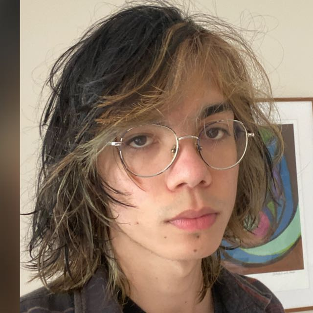

# O Risco do Rabisco: A Jornada das Cores

Jogo realizado por quatro alunos do segundo período de ciências da computação da UFSC e outros dois amigos em 2020.

## 💻 Pré-requisitos

```bash
pip install pygame
```

## Executando o Jogo

Em apenas um terminal execute:

```bash
    make
```

## História do Jogo

<i>Meu nome é Rabisco. Desde que sou guri, meu avô sempre me disse que era especial, não era como as outros.
"Você é especial, Rabisco, um dia você entenderá, meu neto..."
Foi então que descobri. Eu não tenho cor, sou uma tela em branco. Não sou vermelho, verde ou azul, sou branco, e por isso eu posso ficar de <strong>QUALQUER</strong> cor.
Amarelo, laranja, roxo, eu posso ser da cor que eu quiser, e ganho seus poderes.
Desde que descobri isso, eu explorei o mundo, fui de uma ponta a outra do arco iris, mas logo me enjoei.
Todo mundo ja conhece essas cores, todo mundo ja viu, pra mim elas ja não bastavam, eu queria uma cor melhor, uma cor única.
Eu queria a cor lendária, a cor suprema, os mitos falam dela a gerações.
Infelizmente conseguir a cor não é tão simples, ela fica guardada num castelo do outro lado do mundo... e vou ter que derrotar seu guardião...
...O Rei das Cores!
É para la que vou, esse é meu destino, é disso que meu avo falava!
Eu vou até o castelo do Rei das Cores, e assumir a cor suprema pra mim!</i>

## Criadores

<table>
  <tr>
    <td align="center">
      <a href="https://github.com/arthurjolo">
        <br>
        <sub>
          <b>Arthur João Lourenço</b>
        </sub><br>
        Desenvolvedor
      </a>
    </td>
    <td align="center">
      <!-- <a href="https://github.com/bnmfw"> -->
        <br>
        <sub>
          <b>André Hanazaki Peroni</b>
        </sub><br>
        Diretor de Música
      </a>
    </td>
    <td align="center">
      <a href="https://github.com/bnmfw">
        <br>
        <sub>
          <b>Bernardo Borges Sandoval</b>
        </sub><br>
        Desenvolvedor
      </a>
    </td>
    <td align="center">
      <a href="https://github.com/yokiyoki87">
        <br>
        <sub>
          <b>Otávio Wada</b>
        </sub><br>
        Desenvolvedor
      </a>
    </td>
    <td align="center">
      <a href="https://instagram.com/airatirgeuc?igshid=MW4wbHg0Z3luNWhheQ==">
        <br>
        <sub>
          <b>Vicente Tavares Alves Ferreira</b>
        </sub><br>
        Diretor de Arte
      </a>
    </td>
    <td align="center">
      <!-- <a href="https://github.com/LucasYuki"> -->
        <br>
        <sub>
          <b>Victor Cunha</b>
        </sub><br>
        Desenvolvedor
      </a>
    </td>
  </tr>
</table>